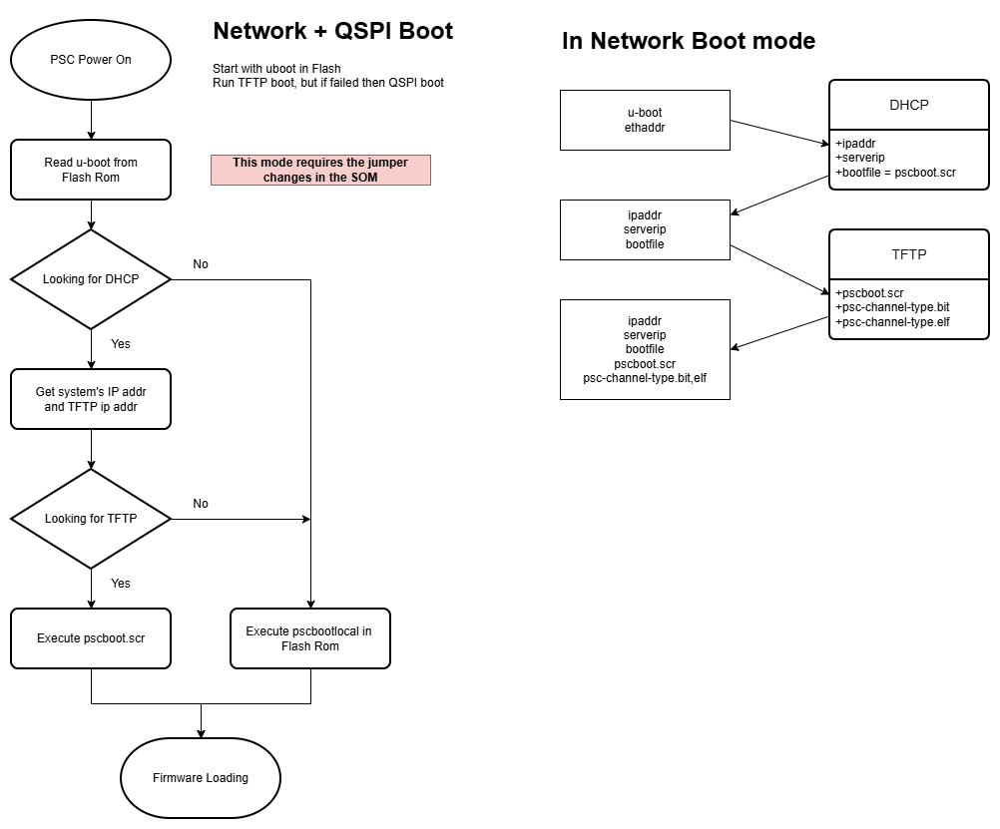

# U-boot for PSC firmware management

## Introduction
ALS-U controls has planed to deploy hundreds of power supply controller for AR and SR.
We employed the u-boot to manage the firmwares for the different PSC kinds centrally.

Here's a brief description of the PSC unit's boot process:

1. When the system powered on, it reads the `u-boot` boot loader in the `Flash memory`.
2. u-boot sends the DHCP request to obtain the local ip address, TFTP server ip address and the boot script name
3. DHCP sends back these information to the requesters per ethenet address
4. u-boot executes the boot script that downloads the FPGA bit file and ELF file from the TFTP server
5. if necessary, u-boot updates the Flash memory with the downloaded bit and elf file
6. u-boot programs the FPGA and start the PSC application



This approach requires DHCP and TFTP server in the network.
Each device should have uinque MAC and IP address.

To achieve the goal, we prepared following topics :
- [U-boot boot loader and environment script](#u-boot-boot-loader-and-environment-script)
- [TFTP boot script](#tftp-boot-script)
- [DHCP configuration](#dhcp-server-configuration)
- [QSPI Flash update with SD card](#qspi-flash-update-with-sd-card)

<br>

## Prerequisites
*This document doesn't describe how to prepare/setup the prerequisites*

To get fully configured system you need to prepare following things :

- A well planned list of the unit name, Ethernet address, IP address
- Ubuntu 22, 24, Debian 12, Rocky 8.10
- Xilinx Environment: tested on 2020.2, likely a loose dependency
- SD card
- TFTP and DHCP server
- A screw driver to open the chassis cover (and switch the jumper SW1)

__NOTICE__ For thouse who don't want to access to the AMD site then download this squash file which contains Vitis 2020.2 and deploy into your /opt. 
This file size is 36 GB : [Vivado squash file](https://drive.google.com/file/d/163ZJ_rJzZPckpBfzCukem66jI8zC2MGq/view?usp=drive_link)

<br>

## U-boot boot loader and environment script
We utilize the `SD card` to write the `Flash memory` with U-boot. 
We are going to generate the boot loader and the scripts to configure the boot sequence.
*NOTE that the SD card is only used once to write the Flash memory.* 
 
- BOOT.bin     -- boot loader
- uboot.env    -- a script to program the Flash memory
- qspiboot.env -- to be dumped to Flash memory

<br>

[Picozed 7030 SOM](https://www.avnet.com/opasdata/d120001/medias/docus/126/$v2/5279-UG-PicoZed-7015-7030-V2_0.pdf) contains 16 MB (256MiB) of Flash memory which is enough space to hold not only the u-boot binary but also FPGA bit, PSC elf and other environment scripts.
Here's our plan for the 16 MB of Flash memory area

| Begin | End | Contents | Size |  NOTE |
| :--- | :--- | :--- | :--- | :-- |
| 0x000000 | 0x0FFFFF | BOOT.bin | 1MB |  U-boot boot loader |
| 0x100000 | 0x11FFFF | qspiboot.env | 128KB |  QSPI Flash boot script |
| 0x120000 | 0x13FFFF | qspiboot-redund.env | 128KB | copy of qspiboot.env |
| 0x200000 | 0x7FFFFF | psc.bit | 6MB | FPGA bitstream |
| 0x800000 | 0xAFFFFF | psc.elf | 2MB | PSC FreeRTOS application |
| 0xB00000 | 0xFFFFFF | Free space | 4MB | PSC unit parameters (calibration, FOFB network etc.,) |

<br>
Let's start with Build U-boot image
<br>
<br>


## Build U-Boot image

Build U-Boot for Power Supply Controller,
based on [Picozed 7030 SOM](https://www.avnet.com/opasdata/d120001/medias/docus/126/$v2/5279-UG-PicoZed-7015-7030-V2_0.pdf) (Zynq-7000)

For more detail about u-boot, see upstream u-boot [README](README).

<br>

### <a name="fsbl"></a> Build fsbl.elf

Generate `fsbl.elf` with generate_fsbl.tcl in this repo:

```sh
# Debian system dependencies
sudo apt-get install git libssl-dev uuid-dev libgnutls28-dev
# If you system is Rocky Linux and in case when you encountered this error : "xlsclients is not available on the system" 
sudo dnf install xorg-x11-utils xorg-x11-app

# Common build steps
git clone ssh://git@git-local.als.lbl.gov:8022/alsu/configuration/u-boot.git

cd u-boot

# Assuming your xilinx environment is under /opt/Xilinx/Vitis
source /opt/Xilinx/Vitis/<Version>/settings64.sh

xsct -norlwrap generate_fsbl.tcl picozed xsa/System.xsa 
```

Now you should have `fsbl.elf`.

<br>

### Build U-boot


```sh
# Assuming you're in u-boot folder
make ARCH=arm CROSS_COMPILE=arm-linux-gnueabihf- distclean

make ARCH=arm CROSS_COMPILE=arm-linux-gnueabihf- xilinx_zynq_picozed_psc_defconfig

make ARCH=arm CROSS_COMPILE=arm-linux-gnueabihf- all
```

Result `u-boot.elf`.

<br>

### Assemble BOOT.bin

To create a bootable image, the resulting `u-boot.elf`
needs to be combined with an `fsbl.elf` using the `bootgen` tool.

```sh
# create u-boot.bif
u_boot:
{
        [bootloader]fsbl.elf
        u-boot.elf
}

# generate bin files
bootgen -arch zynq -image u-boot.bif -w -o BOOT.bin
```

`BOOT.bin` should now be exist.


<br>

### Generate initial environment: uboot.env, qspiboot.env
At this step we are going to create **environment binaries** for SD card and Flash memory.\
Let's prepare `uboot_env_sd.txt` as follows and generate `uboot.env` and `uboot-redund.env` first.

```sh
#uboot_env_sd.txt:

bootdelay=5
autostart=n
autoload=n
ubootfile=BOOT.bin
ubootenv=qspiboot.env
memaddr=0x30000000
envaddr=0x30100000
ubootbinsize=0x100000
ubootenvsize=0x20000

bootcmd= echo "Writing Flash Rom"; \
   fatload mmc 0:1 ${memaddr} ${ubootfile}; \
   fatload mmc 0:1 ${envaddr} ${ubootenv}; \
   sf probe 0 0 0; \
   echo "Move unit parameters to Free space"; \
   sf read 0x38000000 0x0 0x40000; \
   sf erase 0xB00000 0x40000; \
   sf write 0x38000000 0xB00000 0x40000; \
   echo "writing u-boot"; \
   sf erase 0x0 0x140000; \
   sf write ${memaddr} 0x0 ${ubootbinsize}; \
   echo "write env"; \
   sf write ${envaddr} 0x100000 ${ubootenvsize}; \
   sf write ${envaddr} 0x120000 ${ubootenvsize}; \
   echo "QSPI programming completed.. "
```

Now create `uboot.env`  

```sh
./tools/mkenvimage -r -s 0x20000 -o uboot.env uboot_env_sd.txt

cp uboot.env uboot-redund.env
```

You now have `uboot.env` and `uboot-redund.env`.


__NOTICE__ The `-r` and `-s` arguments must match u-boot build time configuration in `.config`.

The `-r` argument must be passed if `CONFIG_SYS_REDUNDAND_ENVIRONMENT` is enabled (default),
and omitted if it is not.  Failure to do so will result in `bad CRC`.

The value passed to `-s` should match `CONFIG_ENV_SIZE` from the u-boot `.config`.

__NOTICE__ The selection of 0x38000000 as the temporary load address must not
overlap with any of the address ranges used by `psc.elf`.
See `readelf` for details.

<br>

Next step is to create the **environment** for Flash memory <a name="qspienv"></a>

```sh
#uboot_env_sf.txt:

ethaddr=xx:xx:xx:xx:xx:xx
bootdelay=5
autostart=n
autoload=n
memaddr=0x30000000
bitsize=0x600000
elfsize=0x200000

net_boot=\
   echo "--- Loading firmware from Network ---";\
   dhcp;\
   tftpboot ${memaddr} ${bootfile};\
   source ${memaddr}

qspi_boot=\
   echo "--- Loading from QSPI Flash ---"; \
   sf probe 0 0 0; \
   sf read ${memaddr} 0x200000 ${bitsize}; \
   fpga loadb 0 ${memaddr} 0x1;\
   sf read ${memaddr} 0x800000 ${elfsize}; \
   setenv autostart y; \
   bootelf ${memaddr};

bootcmd=run net_boot || run qspi_boot || echo "FATAL: All boot sources failed.";
```

Replace `xx:xx:xx:xx:xx:xx` with your unit's MAC address. However here's the break point.


For ALS-U deployment we decide not to specify MAC address at this stage but just to use 00:00:00:00:00:00. 
Once technicions update the Flash memory for all PSC units, we are going to change the MAC address one by one through serial terminal.


Now create `qspiboot.env`  

```sh
./tools/mkenvimage -r -s 0x20000 -o qspiboot.env uboot_env_sf.txt
```

If you followed up the procedure correctly, you now have `BOOT.bin`, `uboot.env`, `uboot-redund.env` and `qspiboot.env`. Copy these files to your SD card.

<br>

## TFTP boot script


Here's the example of `psc-2ch-hss.txt` :

```sh
#memaddr=0x30000000
#bitsize=0x600000
#elfsize=0x200000

setenv bitname psc/psc-2ch-hss.bit
setenv elfname psc/psc-2ch-hss.elf

setenv bitaddr 0x31000000
setenv elfaddr 0x32000000

setenv autostart n
setenv autoload n
setenv updateflash n
setenv updateNETCNF n

echo "--- Loading firmware from Network ---"
dhcp
echo "Loading bitstream from TFTP..."
tftpboot ${bitaddr} ${bitname}
echo "Loading ELF from TFTP...";
tftpboot ${elfaddr} ${elfname};

if test "${updateflash}" = "y"; then
    echo "Updating the firmware in your flash memory is enabled. Executing commands..."
    sf probe 0 0 0;
    echo "write FPGA bitstream to Flash memory";
    sf erase 0x200000 ${bitsize};
    sf write ${bitaddr} 0x200000 ${bitsize};
    echo "write ELF executable to Flash memory";
    sf erase 0x800000 ${elfsize};
    sf write ${elfaddr} 0x800000 ${elfsize};
    echo "Update finished"
fi

if test "${updateNETCNF}" = "y"; then
    echo "Updating the NET.CNF in SD card is enabled. Executing commands..."
    mmc info;
    tftpboot 0x33000000 psc/NET.CNF;
    md 0x33000000;
    fatwrite mmc 0:1 0x33000000 NET.CNF $filesize;
    echo "Update finished";
fi

echo "Writing bitstream into FPGA...";
fpga loadb 0 ${bitaddr} ${filesize};

setenv autostart y
bootelf ${elfaddr}
```
__NOTE 1__: you can reprogram the Flash memory by setting `setenv updateflash y` \
__NOTE 2__: you can trasnfer your NET.CNF file to the SD card `setenv updateNETCNF y` 

<br>

Now generate `psc-2ch-hss.scr`
```
./tools/mkimage -A arm -T script -C none -n "PSC-2CH-HSS Boot Script" -d psc_2ch_hss.txt psc-2ch-hss.scr
```

Other scripts (e.g. psc-4ch-mss.scr) can be generated accordingly.

<br>

Now you have psc-2ch-hss.scr, psc-4ch-mss.scr, psc-4ch-msf.scr, psc-4ch-hss.scr and psc-4ch-hsf.scr and move these files to your TFTP root directory
```sh
# Assuming TFTP root directory is /srv/tftp/ 
mv psc-*.scr /srv/tftp/
```

<br>

## DHCP server configuration
/etc/dhcp/dhcpd.conf : check this file if dhcpd.conf has following options configured correctly.

- hardware ethernet: MAC address
- fixed-address: unit's ip address
- next-server: TFTP server ip address
- filename: boot script in the TFTP

Example dhcpd.conf:
```sh
subnet 10.16.18.0 netmask 255.255.255.0 {
    option subnet-mask 255.255.255.0;
    option broadcast-address 10.16.255.255;  # broadcast to other subnets
    option domain-name "als.private.lbl.gov";
    option routers 10.16.18.1;               # check correct router to use

    host psc-01 {
        hardware ethernet 00:19:24:00:21:01;      
        fixed-address 10.16.17.11;         # ip address to be assigned to psc
        next-server 10.16.18.12;           # TFTP server ip address
        filename "psc-2ch-hss.scr";        # boot script in the TFTP
    }

    host psc-02 {
        hardware ethernet 00:19:24:00:21:02;
        fixed-address 10.16.17.12;
        next-server 10.16.18.12;
        filename "psc-4ch-mss.scr";
    }  
    
    ...

    host psc-FF {
        hardware ethernet 00:19:24:00:23:FF;
        fixed-address 10.16.17.12;
        next-server 10.16.18.12;
        filename "psc-4ch-hss.scr";
    }
}

```
__NOTICE__ Check firewall setting and routers to receive/send dhcp request and response packets between the different subnets.


<br>

## QSPI Flash update with SD card 

1. Connect the serial cable and open the terminal
2. Open the chassis cover and check the jumper switch (SW1) is in `SD CARD BOOT MODE`[^1]
3. Insert the SD card and power on. Wait for 30 second and check the terminal.[^2]
4. Power Off and change the jumper to `QSPI BOOT MODE`
5. Close the chassis cover and power on
6. Check the terminal. Here's `break point`:
   -  Boot process should be done if you set your MAC address in `qspiboot.env`: Refer to [generate initial environment](#qspienv)
   -  If you didn't, you should press any key within 5 secs before entering auto boot and Refer to the [next section](#if-your-flash-contains-incorrect-mac-address)


[^1] Refer to Figure 5 of the page 28 of [Picozed 7030 SOM](https://www.avnet.com/opasdata/d120001/medias/docus/126/$v2/5279-UG-PicoZed-7015-7030-V2_0.pdf) manual.

[^2]: However, the SD card can remain in the slot because PSC application look for the NET.CNF file in the SD card for network configuration.

### If your Flash contains incorrect MAC address
Intended or unintended you didn't set the correct MAC address then you can correct it
through the serial terminal. 

```sh
sf probe
# here assuming your MAC is 00:11:22:33:44:55
setenv -f ethaddr 00:11:22:33:44:55
saveenv
```

